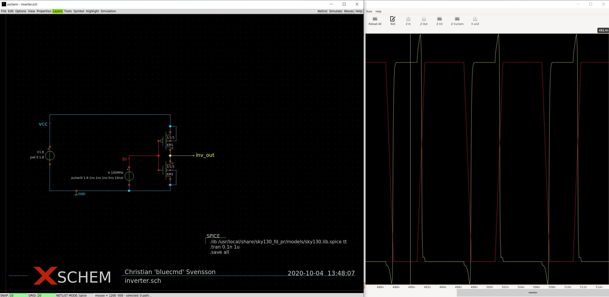

# Getting started with xschem with sky130

Let's build an inverter using xscheme in the
[Skywater 130nm process](https://skywater-pdk.readthedocs.io).



## Background

You are working for Inverter-Tech Inc. which specializes in taking
something and doing the opposite. So far the company has made a living
by producing batteries that have their polarities inverted. Sales have been
going down, and they now want to break into the digital era. All the rage
in the year 2020 is digital inverters. Taking a 0 and turning it into a 1 seems
to be what all the kids are talking about.

You have been tasked to use the newly open-source'd process called
[sky130](https://skywater-pdk.readthedocs.io) to design the company's new
crown jewel - the Digital(TM) Inverter(R).

### What is Schematic Capture and why do we need it?

It is the process where you *capture* an idea as a *schematic*. It is a term
used to describe producing a schematic which can be used to describe some
electronic circuit. When simulating the component or later designing the
full chip you will use the output of the schematic to verify that the final
result is what your schematic describes. This output is called a *netlist*.

Alternativly you can also design your component in a
Hardware Description Language (HDL) such as Verilog or VHDL. This can the
be used to automatically produce the netlist. It is a very good way to make
large digital designs, but for analog designs it quickly becomes complicated.

In order to design our inverter, we will have to describe it as an electronic
circuit in some form of schematic editor. Here we will use xschem for this
purpose. We could have described it in HDL as explained earlier, but the goal
of this tutorial is to learn how to manually design an inverter using analog
components.

### What is a process?

A process commonly refers to a fabrication process for which chips are made.
Skywater 130 nm is the name of the process we use here, which is usually
shortened to `sky130`. There are hoards of other processes out there but what
makes sky130 special is that it is open-source and does not require signing of
an non-disclosure agreement (NDA) in order for it to be used.

Every process has so called *primitives* that are the basic building blocks
we can use to define a chip in that process. It is crucial that we use those
blocks and when we simulate that we use *models* that describe how those blocks
work in an environment that is as close to what we will have our chip running in
as possible.

The collection of files needed to use a process is called a Process Design Kit
or *PDK*. In our case the PDK we will use is `sky130_fd_pr` which stands for
Skywater 130nm Foundry Primitives.

## Installation

NOTE: The following assumes Ubuntu 20.04. For other Linux distributions the
steps might differ somewhat. Versions might have been updated since the writing
of this guide and you might need to adopt some steps accordingly. Fixes are
very much welcomed!

The tools we will install are:

 * xscheme - The schematic capture tool
 * ngspice - The circuit simulator
 * gaw - A waveform viewer to view the simulation results

### Installation of ngspice

A decently recent version of ngsice is present in the Ubuntu repository so
installing it as easy as:

```
sudo apt install ngspice
```

### Installation of gaw

Gaw is not packaged for Ubuntu so we will have to build it ourselves.

**TODO**: Write this in a nicer way, this is just a dump right now

```
wget http://download.tuxfamily.org/gaw/download/gaw3-20200922.tar.gz
sudo apt install libgtk-3-dev
./configure
make -j$(nproc)
sudo make install

# Important!
# Start gaw once and exit it
gaw
# Now change the rcfile
$EDITOR ~/.gaw/gawrc
# Find up_listenPort = 0 and set it to 2020.
# This is needed for xschem to integrate well with gaw
```

Optional: `gaw examples/rlc_lpf_trans.dat` to figure out how the tool works.

### Installation of xschem

**TODO**: Write this in a nicer way, this is just a dump right now

```
sudo apt build-dep xschem # todo: expand to what is actually needed
sudo apt install xterm graphicsmagick ghostscript
# GraphicsMagick is needed for PNG export, ghostscript for pdf
git clone https://github.com/StefanSchippers/xschem.git
./configure
make -j$(nproc)
sudo make install
```

1) Go into Simulation -> Configure simulators and tools.
1) Make sure "Ngpsice Batch"[1] and Gaw is selected.
  **Tip**: I like ngspice batch to be the following which allows you to see the status:
  `$terminal -e 'set -o pipefail; (ngspice -b -r "$n.raw" "$N" | tee "$n.out") || (echo -e "\n** ngspice exited with error code $? **\nPress enter to close"; read)'`
1) Keep Fg checked and Status unchecked.
1) Press "Accept and close"

[1] Ngspice batch is needed for the raw-file to be created which Gaw uses to populate its table.

### Installation of sky130 primitives

**TODO**: Describe why we are doing this maybe.

```
cd /usr/local/share/
sudo mkdir sky130_fd_pr
chown $USER sky130_fd_pr
git clone https://foss-eda-tools.googlesource.com/skywater-pdk/libs/sky130_fd_pr sky130_fd_pr
```

## Basics of xschem

These two videos of using xschem are well worth the time. Watch them and follow
along.

 * [Editing and Simulation in xschem](https://xschem.sourceforge.io/stefan/xschem_man/video_tutorials/editing_and_sim.mp4)
 * [Probing signals with gaw](https://xschem.sourceforge.io/stefan/xschem_man/video_tutorials/probe_to_gaw.mp4)

Congrats! You simulated a schematic using open-source tools!

## Designing an inverter

TODO: Describe the process

**NOTE**: To use the pmos4/nmos4 components, you should use these parameters:
```
model=sky130_fd_pr__pfet_01v8 w=1 l=1 m=1 spiceprefix=X
```

The `spiceprefix=X` is needed because the FET is defined as a so called
subcircuit and will not be correctly located otherwise. If you get
an error like `could not find a valid modelname` you might have forgotten to
add this property.

The final result is available in `inverter.sch`.
If you installed the PDK somewhere else make sure to update the `.lib` statement
in the SPICE component in the lower-right corner.
